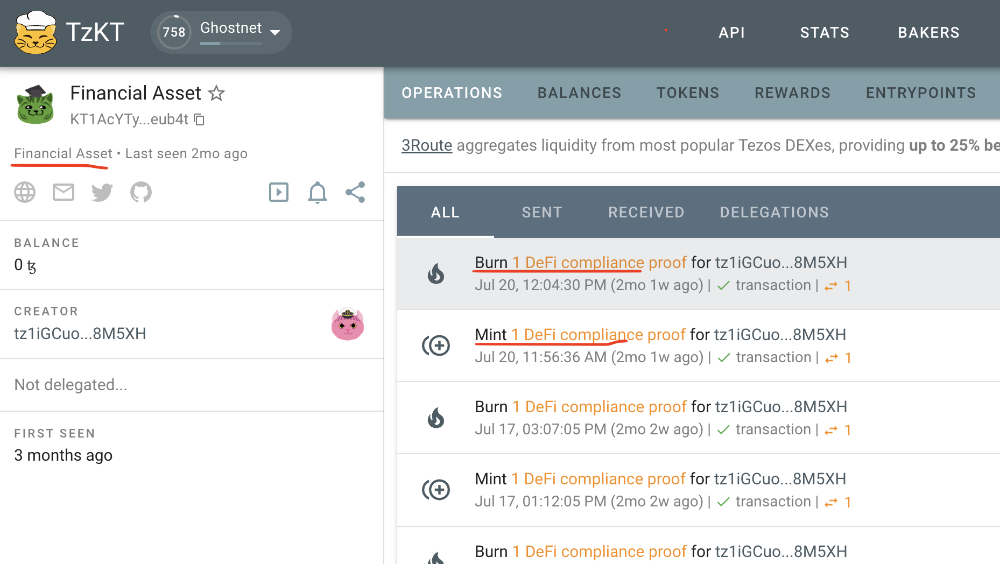

In this 3rd and last part on how to create an FA2 compatible Soulbound Token on Tezos, we'll add a few view methods to read the state of the smart contract, ensure that the balances for each token owner can be indexed by external tools such as explorers, and we'll add a few missing features.

If you haven't already, please make sure to read the [1st part](/blog/2023-09-22-tezos-sbt-part1/) and [2nd part](/blog/2023-09-23-tezos-sbt-part2/) of this series on how to create a Soulbound Token on the Tezos blockchain using FA2.

## Token balances

Given that FA2 doesn't specify how tokens are minted and stored, there's no standard way by looking at a smart contract's state to determine an owner's token balance nor easily track transfers. This makes it difficult for external tools such as [TzKT](https://tzkt.io/) to track balances.

A proposed solution is to maintain a `ledger` `big_map` with the contract storage and keep it updated during mints and burns.
Given that our Soulbound Tokens are similar to NFTs, we'll use the "NFT asset contract" standard and use a `big_map %ledger nat addresst` datastructure, which in jsLigo looks like this:

```js
type storage = {
  // add this to the other storage properties
  ledger: big_map<nat, address>
};
```

Now we need to maintain it upon mint:

```js
const mint = (owner: owner, ipfs_url: ipfs_url, store: storage): return_ => {
  // Add the new address to the ledger
  let new_ledger = Big_map.add(store.token_counter, owner, store.ledger);

  return [
    list([]),
    {
      ...store,
      ledger: new_ledger
      // ...
    }
  ]
```

And burn operations:

```js
const burn = (owner: owner, store: storage): return_ => {
  // after'we identified the token_id, we simply drop it from the ledger
  let new_ledger = Big_map.remove(token_id, store.ledger);

  return [
    list([]),
    {
      ...store,
      ledger: new_ledger
      // ...
    }
  ];
};
```

If done properly, indexers such as [TzKT](https://tzkt.io/) should reference our assets as "Financial Assets" and start tracking ownership:



## View methods

We've seen that when FA2 was first standardized there was no easy way of reading a smart contract's state apart from deriving it from its storage. The `balance_of` method has some convoluted logic requiring a smart contract to call it by passing it a set of callbacks.

Fortunately, we now have access to "view methods" which are read only methods that will read the state of a smart contract without actually executing and consuming gas.

We essentially want 3 methods:

1. Check if an owner owns a token
1. get the token uri
1. get the token creation date.

### `has_token` view method

This method will help us determine if an owner (public key) actually owns a token.
Fortunately, we're currently maintaining a `tokens_by_owner` `big_map`, so we'll just do a simple lookup to determine whether a public address owns a token.

```js
// @view
const has_token = (owner: owner, store: storage): boolean =>
  Big_map.mem(owner, store.tokens_by_owner);
```

### `token_uri` view method

We also want a simple view method to retrieve the `ipfs_url`.
We're already storing it in the token metadata so we should just read it from there after having retrieved the token id.

However, in our implementation, we decided to maintain a separate data structure to store `ipfs_url` alongside the `creation_date` which we'll cover later. This is probably a mistake as we should instead just extend the token metadata and remove the extra structure. But for now, we'll maintain a new `big_map` called `tokens`:

```js
type token_data = { owner, ipfs_url, creation_date: timestamp };

type storage = {
  // add this to the other storage properties
    tokens: big_map<nat, token_data>
};
```

```js
// @view
const token_uri = (owner: owner, store: storage): ipfs_url => {
  let token_id: nat =
    Option.unopt_with_error(
      Big_map.find_opt(owner, store.tokens_by_owner),
      "Owner doesn't have a token"
    );
  return match(
    Big_map.find_opt(token_id, store.tokens),
    { Some: token => token.ipfs_url, None: () => failwith("Unexpected error.") }
  )
};
```

Notice the `// @view` pragma, this notified the compile that the method doesn't change the state of the smart contract (write) and can be executed on a node directly, without being added to a transaction. Those view methods are also not listed as entrypoints!

Of course, we need to populate this `big_map` upon mint:

```js
const mint = (owner: owner, ipfs_url: ipfs_url, store: storage): return_ => {
  let new_token =
    { owner: owner, ipfs_url: ipfs_url, creation_date: Tezos.get_now() };
  let new_tokens = Big_map.add(store.token_counter, new_token, store.tokens);

  return [
    list([]),
    {
      ...store,
      tokens: new_tokens,
      // ...
    }
  ]
```

And burn operations:

```js
const burn = (owner: owner, store: storage): return_ => {
  let new_tokens = Big_map.remove(token_id, store.tokens);

  return [
    list([]),
    {
      ...store,
      tokens: new_tokens,
      // ...
    }
  ];
};
```

### `token_creation_date` view method

The last view method we'd like to add is a method to retrieve a token's creation date.
The creation date is useful for a consumer to determine if a token has expired according to their criteria. A proof of DeFi Compliance could be forever valid to verify if a user has been in compliance, but could have expired to check if they still are.

We snuck the `creation_date` property in our `tokens` datastructure. Upon minting, we simply initialize it with `Tezos.get_now()` which returns the transaction block's timestamp.

To read this value, we just need to add a new view method:

```js
// @view
const token_creation_date = (owner: owner, store: storage): timestamp => {
  let token_id: nat =
    Option.unopt_with_error(
      Big_map.find_opt(owner, store.tokens_by_owner),
      "Owner doesn't have a token"
    );
  return match(
    Big_map.find_opt(token_id, store.tokens),
    {
      Some: token => token.creation_date,
      None: () => failwith("Unexpected error.")
    }
  )
};
```

This concludes our list of view methods. Given that our contract is 100% compatible with FA2, external tools such as explorers or wallets are able to retrieve an owner's tokens and render them properly, or track mint and burn operations. Consumers of our SBT contracts also have additional convenience methods such as our new view methods to verify if a public key owns a token and check its creation date without spending gas fees. We're pretty feature complete from a Soulbound Token standpoint and are on par with our [Ethereum ERC721 implementation](/blog/2023-07-25-ethereum-sbt/).

There's just one last aspect to cover.

## Permissioning

We've seen that we're not using the `update_operators` logic in FA2 which I believe is considered deprecated.
We won't need much granularity to determine who can mint, burn or transfer tokens, our rules as as follows:

1. The wallet deploying the contract is the de facto `ADMINISTRATOR`
1. Only `ADMINISTRATOR` may `mint` tokens
1. `ADMINISTRATOR` can burn any token
1. Token owner may burn their own tokens
1. `ADMINISTRATOR` can add or remove other `ADMINS`

For that, we're going to store a set of `ADMINISTOR`s in our smart contract:

```js
type storage = {
  admins: set<address>,
}
```

We'll initialize the contract with an admin during deployment:

```js
await tezos.contract.originate({
  code, // this is the michelson json contract
  {
    // adding the default admin
    admins: [ADMIN_TEZOS_WALLET_ADDRESS],

    // ...
    token_counter: 0,
    tokens_by_owner: MichelsonMap.fromLiteral({}), // will be populated during minting
    token_metadata: MichelsonMap.fromLiteral({}), // will be populated during minting
    name: char2Bytes("Proof of DeFi Compliance"), // will be read and reused for each token's metadata
    symbol: char2Bytes("DEFI") // will be read and reused for each token's metadata,
  // ...
  }
});
```

And add an entrypoint to add admins:

```js
const add_admin = (admin: address, store: storage): return_ => {
  if (!Set.mem(Tezos.get_sender(), store.admins)) {
    return failwith("FA2_NOT_ADMIN")
  };
  return [list([]), { ...store, admins: Set.add(admin, store.admins) }]
};
```

And remove admins:

```js
const remove_admin = (admin: address, store: storage): return_ => {
  if (!Set.mem(Tezos.get_sender(), store.admins)) {
    return failwith("FA2_NOT_ADMIN")
  };
  return [list([]), { ...store, admins: Set.remove(admin, store.admins) }]
};
```

Now that we track admins, we can ensure that only admins are allowed to mint tokens:

```js
const mint = (owner: owner, ipfs_url: ipfs_url, store: storage): return_ => {
  if (!Set.mem(Tezos.get_sender(), store.admins)) {
    return failwith("FA2_NOT_OPERATOR")
  };

  //...
};
```

Or burn:

```js
const burn = (owner: owner, store: storage): return_ => {
  // Also allow token's owner to burn
  if (!Set.mem(Tezos.get_sender(), store.admins) && Tezos.get_sender() != owner) {
    return failwith("FA2_NOT_OPERATOR")
  };

  //...
};
```

## Summary

This concludes our 3 part series on how to create a Soulbound Token on Tezos using FA2.

We've ensured that our contract is 100% compliant with the standard, allowing tools such as explorers, wallets, libraries etc. to detect an FA2 compliant contract and know how to consume it. We've also added our own features to bring the contract on par with our [Ethereum ERC721 implementation](/blog/2023-07-25-ethereum-sbt/). You may take a look at our implementation on our [GitHub](https://github.com/meranti-web3/ssi-sbt/blob/main/sbt-contract-tz/contracts/SoulboundToken.jsligo).

Thanks for reading, we hope it was helpful to you and stay tuned for more Web3 content!
